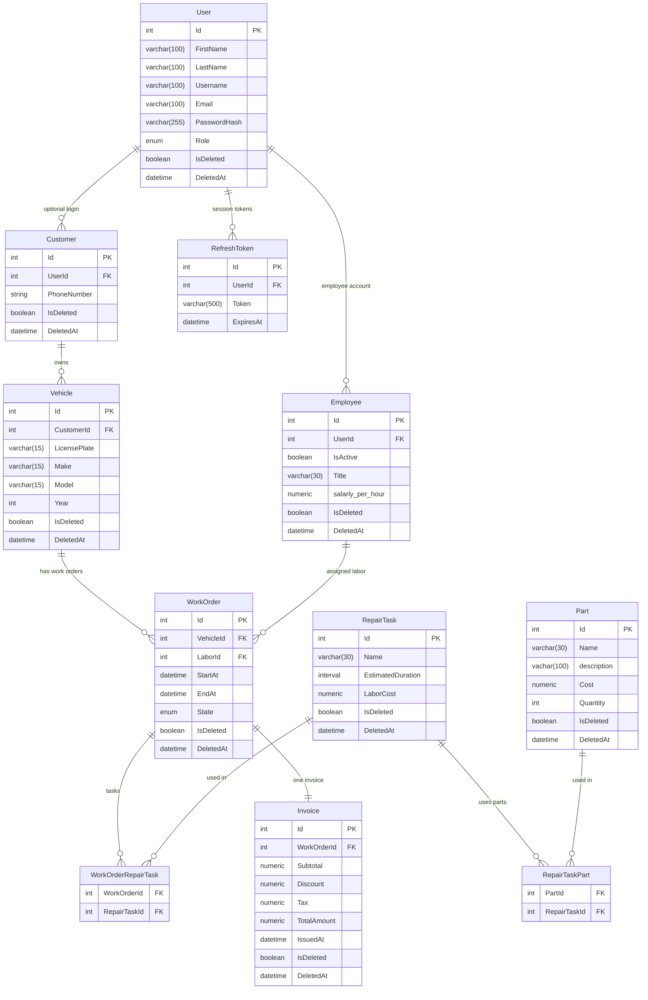

```mermaid
erDiagram

    User {
        int Id PK
        varchar(100) FirstName
        varchar(100) LastName
        varchar(100) Username
        varchar(100) Email
        varchar(255) PasswordHash
        enum Role
        boolean IsDeleted
        datetime DeletedAt
    }

    Customer {
        int Id PK
        int UserId FK
        string PhoneNumber
        boolean IsDeleted
        datetime DeletedAt
    }

    Vehicle {
        int Id PK
        int CustomerId FK
        varchar(15) LicensePlate
        varchar(15) Make
        varchar(15) Model
        int Year
        boolean IsDeleted
        datetime DeletedAt
    }

    Employee {
        int Id PK
        int UserId FK
        boolean IsActive
        varchar(30) Title
        numeric salarly_per_hour
        boolean IsDeleted
        datetime DeletedAt
    }

    WorkOrder {
        int Id PK
        int VehicleId FK
        int LaborId FK
        datetime StartAt
        datetime EndAt
        enum State
        boolean IsDeleted
        datetime DeletedAt
    }

    RepairTask {
        int Id PK
        varchar(30) Name
        interval EstimatedDuration
        numeric LaborCost
        boolean IsDeleted
        datetime DeletedAt
    }

    WorkOrderRepairTask {
        int WorkOrderId FK
        int RepairTaskId FK
    }

    Part {
        int Id PK
        varchar(30) Name
        vachar(100) description
        numeric Cost
        int Quantity
        boolean IsDeleted
        datetime DeletedAt
    }

     RepairTaskPart {
        int PartId FK
        int RepairTaskId FK
    }


    Invoice {
    int Id PK
    int WorkOrderId FK
    numeric Subtotal
    numeric Discount
    numeric Tax
    numeric TotalAmount
    datetime IssuedAt
    boolean IsDeleted
    datetime DeletedAt
}


    RefreshToken {
        int Id PK
        int UserId FK
        varchar(500) Token
        datetime ExpiresAt
    }


    %% Relationships

    User ||--o{ Customer : "optional login"
    User ||--o{ Employee : "employee account"
    User ||--o{ RefreshToken : "session tokens"

    Customer ||--o{ Vehicle : "owns"

    Vehicle ||--o{ WorkOrder : "has work orders"
    Employee ||--o{ WorkOrder : "assigned labor"

    WorkOrder ||--o{ WorkOrderRepairTask : "tasks"
    RepairTask ||--o{ WorkOrderRepairTask : "used in"

    RepairTask ||--o{ RepairTaskPart : "uses parts"
    Part ||--o{ RepairTaskPart : "used in"

    WorkOrder ||--|| Invoice : "one invoice"


```